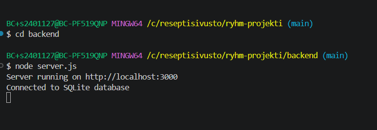

1. Project Name

	recipe website

2. Short Description

	This project is a recipe web application built with Node.js and Express using TheMealDB API.
	Users can browse recipes, search meals by name, and view detailed recipe information including ingredients and instructions.

- The application was created as a group project for learning backend and frontend web development.

3. Screenshots

4. Technologies Used

- HTML
- CSS
- JavaScript
- Node.js
- Express.js
- TheMealDB API
- Git & GitHub

5. My Responsibilities in the Group Project

   (Zumra)

- Connected the application to TheMealDB API
- Created API routes
- Implemented recipe fetching functionality
- Built recipe detail page
- Worked on frontend styling
- Tested application features
- Helped with debugging and fixing errors
- Built and managed the database

  (Lia)


  (Chioma)


  6. Main Features
 
- Browse recipes
- Search meals by name
- View recipe details
- Display ingredients and instructions
- Responsive user interface
- Dynamic data from external API
- Leave a comment

  7. What We Learned
 
- How to build a Node.js and Express application
- How to use external APIs
- How routing works in Express
- How frontend and backend communicate
- Teamwork and GitHub collaboration
- Debugging and problem solving
 
## Installation & Run Instructions

Clone the repository:

```bash
git clone YOUR_GITHUB_LINK
```

Open project folder:

```bash
cd ryhma-projekti
```

Go to backend folder:

```bash
cd backend
```

Install dependencies:

```bash
npm install
```

Start the server:

```bash
node app.js
```

Open browser:

```txt
http://localhost:3000
```

> [!IMPORTANT]
> You must start the Node.js server inside the backend folder because the server is installed there.





Zumra Can, Leano Ncongwane, Chioma Ifezue
